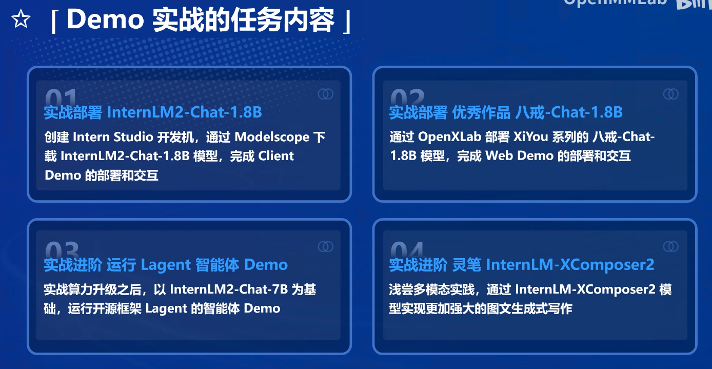
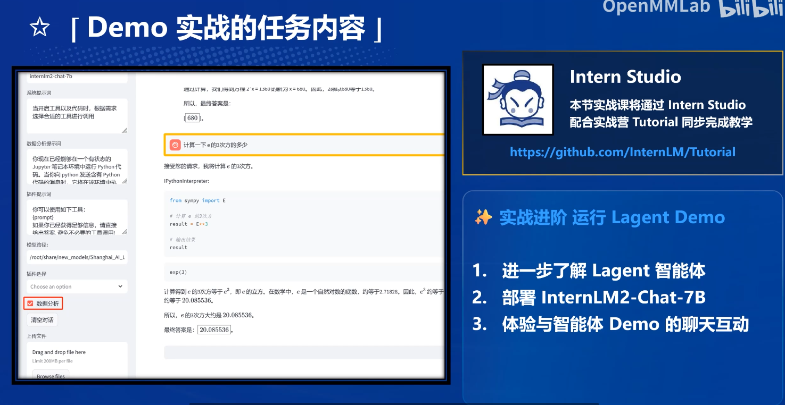
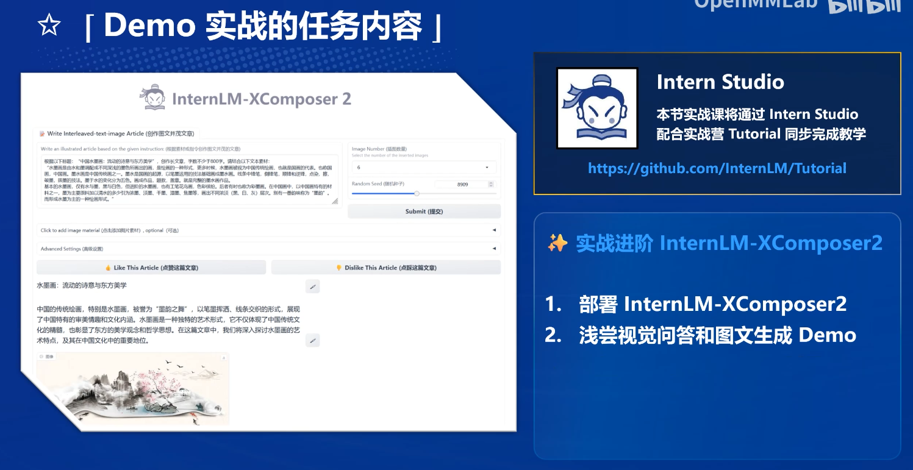
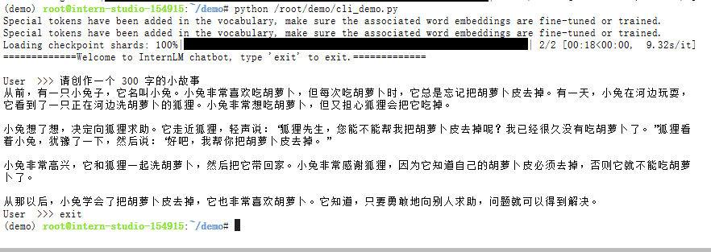
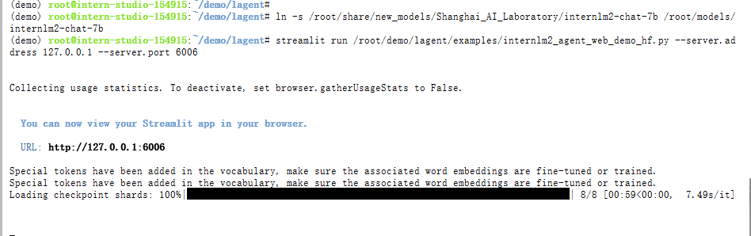
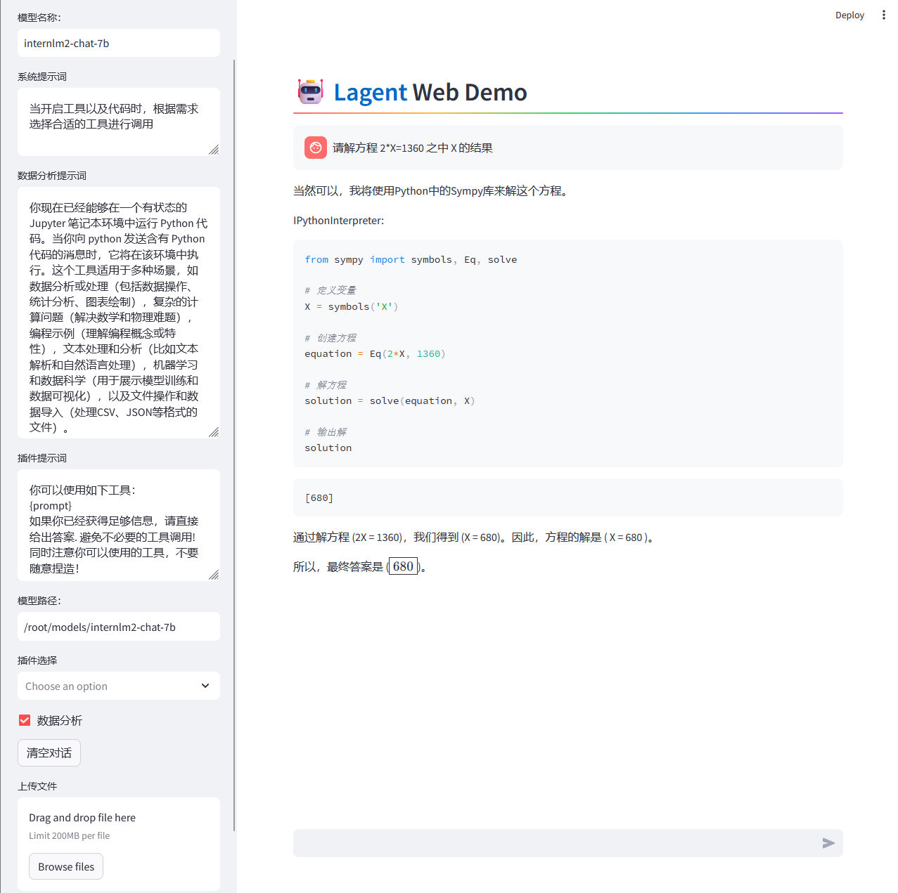
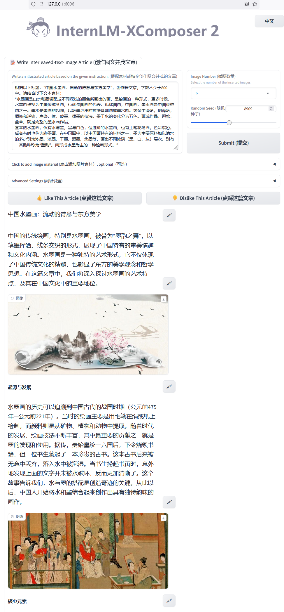
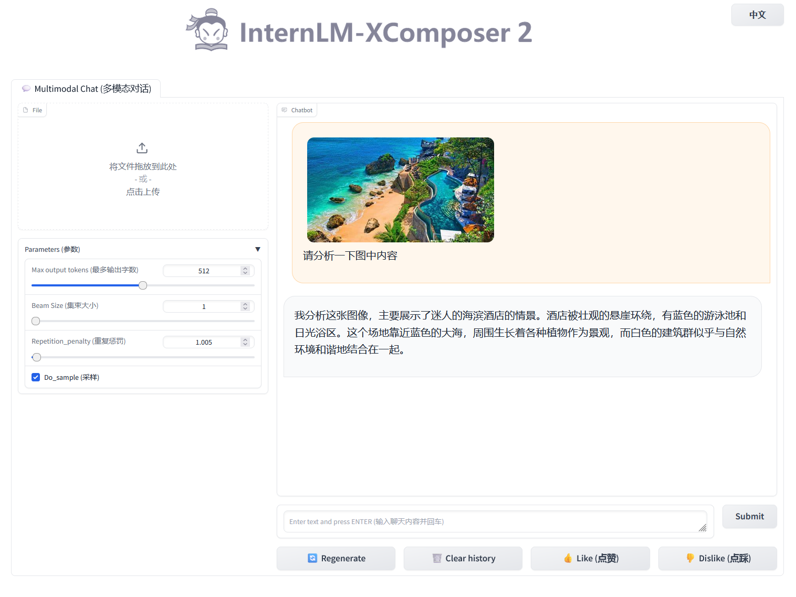

# 6 InternLM2

## 课程信息

视频：

https://www.bilibili.com/video/BV1AH4y1H78d/

教程：

https://github.com/InternLM/Tutorial/blob/camp2/helloworld/hello_world.md

作业：

https://github.com/InternLM/Tutorial/blob/camp2/helloworld/homework.md


课程上新啦~ 

由书生·浦语角色扮演小组长【那路】为大家带来【轻松玩转书生·浦语大模型趣味 Demo】课程~ 

玩转书生·浦语【智能对话】、【智能体解应用题】、【多模态理解及图文创作】等趣味 Demo 

课程文档：[Tutorial/helloworld/hello_world.md at camp2 · InternLM/Tutorial](https://github.com/InternLM/Tutorial/blob/camp2/helloworld/hello_world.md)

课程视频：[轻松玩转书生·浦语大模型趣味 Demo_哔哩哔哩_bilibili](https://www.bilibili.com/video/BV1AH4y1H78d/)

课程作业：[Tutorial/helloworld/homework.md at camp2 · InternLM/Tutorial](https://github.com/InternLM/Tutorial/blob/camp2/helloworld/homework.md) 

临时在周天、周一、周二的这三天将GPU调到 50 GB，大家尽早完成作业，课程最后几天算力会非常紧张，这几天相对较空间

觉得不错欢迎 Star <https://github.com/InternLM/InternLM/>


## 介绍











## 实验


开发机环境：

https://studio.intern-ai.org.cn/


### 实验1


```Java
# 通过拷贝方式，创建新的 conda 环境 demo
studio-conda -o internlm-base -t demo
# 与 studio-conda 等效的配置方案
# conda create -n demo python==3.10 -y
# conda activate demo
# conda install pytorch==2.0.1 torchvision==0.15.2 torchaudio==2.0.2 pytorch-cuda=11.7 -c pytorch -c nvidia

# 激活环境
conda activate demo

# 下载依赖
pip install huggingface-hub==0.17.3
pip install transformers==4.34 
pip install psutil==5.9.8
pip install accelerate==0.24.1
pip install streamlit==1.32.2 
pip install matplotlib==3.8.3 
pip install modelscope==1.9.5
pip install sentencepiece==0.1.99


# 创建文件夹和文件
mkdir -p /root/demo
touch /root/demo/cli_demo.py
touch /root/demo/download_mini.py
cd /root/demo

# 修改 download_mini.py 文件内容
import os
from modelscope.hub.snapshot_download import snapshot_download

# 创建保存模型目录
os.system("mkdir /root/models")# save_dir是模型保存到本地的目录
save_dir="/root/models"

snapshot_download("Shanghai_AI_Laboratory/internlm2-chat-1_8b", 
                  cache_dir=save_dir, 
                  revision='v1.1.0')

# 执行 download_mini.py 下载模型
python /root/demo/download_mini.py

# 修改 cli_demo.py 文件内容
import torch
from transformers import AutoTokenizer, AutoModelForCausalLM


model_name_or_path = "/root/models/Shanghai_AI_Laboratory/internlm2-chat-1_8b"

tokenizer = AutoTokenizer.from_pretrained(model_name_or_path, trust_remote_code=True, device_map='cuda:0')
model = AutoModelForCausalLM.from_pretrained(model_name_or_path, trust_remote_code=True, torch_dtype=torch.bfloat16, device_map='cuda:0')
model = model.eval()

system_prompt = """You are an AI assistant whose name is InternLM (书生·浦语).
- InternLM (书生·浦语) is a conversational language model that is developed by Shanghai AI Laboratory (上海人工智能实验室). It is designed to be helpful, honest, and harmless.
- InternLM (书生·浦语) can understand and communicate fluently in the language chosen by the user such as English and 中文.
"""

messages = [(system_prompt, '')]

print("=============Welcome to InternLM chatbot, type 'exit' to exit.=============")

while True:
    input_text = input("\nUser  >>> ")
    input_text = input_text.replace(' ', '')
    if input_text == "exit":
        break

    length = 0
    for response, _ in model.stream_chat(tokenizer, input_text, messages):
        if response is not None:
            print(response[length:], flush=True, end="")
            length = len(response)


# 执行 cli_demo.py 运行 cli_demo 程序
python /root/demo/cli_demo.py
```





### 实验2


```Java
conda activate demo

cd /root/
git clone https://github.com/InternLM/Tutorial -b camp2
cd /root/Tutorial

python /root/Tutorial/helloworld/bajie_download.py

streamlit run /root/Tutorial/helloworld/bajie_chat.py --server.address 127.0.0.1 --server.port 6006

# 本地 PowerShell 
# 从本地使用 ssh 连接 studio 端口
# 将下方端口号 40249 替换成自己的端口号
ssh -CNg -L 6006:127.0.0.1:6006 root@ssh.intern-ai.org.cn -p 40249 
```


### 实验3


```Python
conda activate demo

cd /root/demo
git clone https://github.com/internlm/lagent.git
cd /root/demo/lagent
# 安装依赖
pip install -e . 

# 软链
# ln -s [源文件或目录] [链接文件或目录]
# ln -s /path/to/original_file /path/to/symlink
ln -s /root/share/new_models/Shanghai_AI_Laboratory/internlm2-chat-7b /root/models/internlm2-chat-7b

# 打开 lagent 路径下 examples/internlm2_agent_web_demo_hf.py 文件，并修改对应位置 (71行左右) 代码：
value='/root/models/internlm2-chat-7b'

# 启动
streamlit run /root/demo/lagent/examples/internlm2_agent_web_demo_hf.py --server.address 127.0.0.1 --server.port 6006
```








### 实验4


图文写作

```Python
conda activate demo

# 补充环境包
pip install timm==0.4.12 sentencepiece==0.1.99 markdown2==2.4.10 xlsxwriter==3.1.2 gradio==4.13.0 modelscope==1.9.5

# 下载 InternLM-XComposer 仓库 相关的代码资源：
cd /root/demo
git clone https://github.com/internlm/InternLM-XComposer.git
cd /root/demo/InternLM-XComposer

# 软链
ln -s /root/share/new_models/Shanghai_AI_Laboratory/internlm-xcomposer2-7b /root/models/internlm-xcomposer2-7b
ln -s /root/share/new_models/Shanghai_AI_Laboratory/internlm-xcomposer2-vl-7b /root/models/internlm-xcomposer2-vl-7b

# 启动程序
cd /root/demo/InternLM-XComposer
python /root/demo/InternLM-XComposer/examples/gradio_demo_composition.py  \
--code_path /root/models/internlm-xcomposer2-7b \
--private \
--num_gpus 1 \
--port 6006
```





图片理解

```Python
conda activate demo

cd /root/demo/InternLM-XComposer
python /root/demo/InternLM-XComposer/examples/gradio_demo_chat.py  \
--code_path /root/models/internlm-xcomposer2-vl-7b \
--private \
--num_gpus 1 \
--port 6006
```





